# Modelo físico — SaaS veterinário (Flutz)

Documento de referência do banco de dados. Não implementa frontend, backend, APIs, gateway nem o fluxo de login na aplicação. O modelo físico já prevê as credenciais e a autorização.

Fonte analisada: modelo físico atual exportado em `estrutura.pdf` / `estrutura.png` (MySQL Workbench).

Implementação do banco: **PostgreSQL 16+**. O script histórico do Workbench permanece em `database/mysql/modelo-fisico-saas-veterinario.sql`. A fonte da aplicação é `database/postgresql/modelo-fisico-saas-veterinario.sql` (Flyway `V1`).

---

## 1. Visão geral

O Flutz é um SaaS multiempresa para clínicas veterinárias. A entidade `empresa` é o tenant.

O modelo cobre:

- cadastro da clínica e página pública configurável;
- autenticação de tutor (CPF + senha), colaborador (e-mail + senha) e administrador do SaaS (e-mail + senha);
- autorização do colaborador por `role`; o administrador do sistema tem poder total na plataforma;
- tutores, pets, espécies e raças;
- colaboradores, papéis e especialidades;
- serviços oferecidos;
- agendamentos e atendimentos;
- vacinas, doenças e prontuário;
- chat;
- campanhas de doação;
- recebimentos da clínica (consulta, serviço, doação);
- assinatura e mensalidade da clínica para a plataforma (planos Básico, Profissional e Premium).

Princípios:

1. Isolar dados por empresa sem colocar `empresa_id` em tabelas cujo tenant já é inequívoco.
2. Preservar o que já estava correto no modelo antigo.
3. Corrigir nomenclatura, FKs, tipos e cardinalidades apenas quando houver problema real.
4. Separar **receita da clínica** (`pagamento`) de **receita da plataforma** (`assinatura` + `fatura_assinatura`).

---

## 2. Diagrama ER

```mermaid
erDiagram
    status ||--o{ empresa : status
    status ||--o{ cliente : status
    status ||--o{ colaborador : status
    status ||--o{ pet : status
    status ||--o{ doacao : status

    status ||--o{ administrador_sistema : status
    administrador_sistema ||--o{ token : cria
    status ||--o{ token : status
    plano ||--o{ assinatura : "1:N"
    empresa ||--o{ assinatura : "1:N historico"
    assinatura ||--o{ fatura_assinatura : "1:N"
    empresa ||--o{ fatura_assinatura : "denorm tenant"
    token ||--o{ fatura_assinatura : "0..1 cupom"

    empresa ||--o{ pagina_secao : "1:N"
    empresa ||--|| hero_section : "1:1"
    imagem_posicao ||--o{ hero_section : posicao
    hero_section ||--o{ hero_section_topico : "1:N"
    empresa ||--o{ avaliacao_cliente : "1:N"
    empresa ||--o{ galeria_imagem : "1:N"
    tipo_redesocial ||--o{ rede_social : tipo
    empresa ||--o{ rede_social : "1:N"

    empresa ||--o{ empresa_cliente : "N:N"
    cliente ||--o{ empresa_cliente : "N:N"
    empresa ||--o{ colaborador : "1:N"
    colaborador ||--o{ colaborador_role : "N:N"
    colaborador ||--o{ colaborador_horario : "grade semanal"
    role ||--o{ colaborador_role : "N:N"

    especialidade ||--o{ empresa_especialidade : catalogo
    empresa ||--o{ empresa_especialidade : "N:N"
    colaborador ||--o{ colaborador_especialidade : "N:N"
    empresa_especialidade ||--o{ colaborador_especialidade : "N:N"

    tipo_servico ||--o{ empresa_servico : catalogo
    empresa ||--o{ empresa_servico : "N:N"

    vacina ||--o{ empresa_vacina : catalogo
    empresa ||--o{ empresa_vacina : "N:N"
    doenca ||--o{ empresa_doenca : catalogo
    empresa ||--o{ empresa_doenca : "N:N"
    pet_especie ||--o{ empresa_pet_especie : catalogo
    empresa ||--o{ empresa_pet_especie : "N:N"
    pet_raca ||--o{ empresa_pet_raca : catalogo
    empresa ||--o{ empresa_pet_raca : "N:N"
    vacina ||--o{ vacina_doenca : "N:N"
    doenca ||--o{ vacina_doenca : "N:N"
    pet_especie ||--o{ pet_raca : "1:N"

    empresa ||--o{ pet : "1:N"
    cliente ||--o{ pet : "1:N"
    pet_especie ||--o{ pet : especie
    pet_raca ||--o{ pet : raca
    colaborador ||--o{ colaborador_pet : ref
    pet ||--o{ colaborador_pet : ref
    pet ||--o{ historico_vacinacao : "1:N"
    vacina ||--o{ historico_vacinacao : aplicada
    atendimento ||--o{ historico_vacinacao : "0..N na visita"
    pet ||--o{ historico_doenca : "1:N"
    doenca ||--o{ historico_doenca : diagnosticada
    atendimento ||--o{ historico_doenca : "0..N na visita"
    historico_vacinacao ||--o{ notificacao_vacina : "1:N avisos"

    empresa ||--o{ agendamento : "1:N"
    cliente ||--o{ agendamento : "1:N"
    pet ||--o{ agendamento : "1:N"
    colaborador ||--o{ agendamento : opcional
    empresa_servico ||--o{ agendamento : opcional
    empresa_servico ||--o{ atendimento : "servico realizado"
    agendamento_status ||--o{ agendamento : status
    agendamento ||--o| atendimento : "0..1"

    empresa ||--o{ atendimento : "1:N"
    cliente ||--o{ atendimento : "1:N"
    pet ||--o{ atendimento : "1:N"
    atendimento_status ||--o{ atendimento : status
    atendimento ||--o{ atendimento_colaborador : "N:N"
    colaborador ||--o{ atendimento_colaborador : "N:N"
    atendimento ||--o{ atendimento_andamento : "1:N"

    empresa ||--o{ doacao : "1:N"
    doacao ||--o{ galeria_doacao : "1:N"

    empresa ||--o{ conta_pagamento : "1:N"
    empresa ||--o{ pagamento : "1:N"
    conta_pagamento ||--o{ pagamento : conta
    cliente ||--o{ pagamento : opcional
    agendamento ||--o{ pagamento : opcional
    atendimento ||--o{ pagamento : opcional
    empresa_servico ||--o{ pagamento : opcional
    doacao ||--o{ pagamento : opcional

    empresa ||--o{ chat : "1:N"
    cliente ||--o{ chat : "1:N"
    pet |o--o{ chat : "0..1"
    agendamento ||--o{ chat : opcional
    atendimento ||--o{ chat : opcional
    chat_motivo ||--o{ chat : motivo
    chat ||--o{ chat_mensagem : "1:N"
    chat ||--o{ chat_colaborador_responsavel : "N:N"
    colaborador ||--o{ chat_colaborador_responsavel : "N:N"
    chat ||--o| chat_finalizacao : "1:1"
    chat ||--o{ chat_avaliacao_colaborador : "1:N"

    empresa ||--o{ auditoria_acao : "tenant opcional"
    auditoria_acao ||--o{ auditoria_dado : "1:N DML"
    empresa ||--o{ solicitacao_titular : "pedido LGPD"
```



Leitura do tenant:

```text
EMPRESA
 ├── CLIENTE                 (via empresa_cliente, N:N)
 │    └── PET                (empresa_id + cliente_id)
 │         ├── HISTORICO_VACINACAO
 │         └── HISTORICO_DOENCA
 ├── COLABORADOR             (exibir_pagina = equipe)
 ├── EMPRESA_SERVICO
 ├── EMPRESA_ESPECIALIDADE
 ├── AGENDAMENTO
 ├── ATENDIMENTO
 ├── PAGINA_SECAO
 ├── HERO_SECTION            (1:1)
 ├── AVALIACAO_CLIENTE
 ├── GALERIA_IMAGEM
 ├── REDE_SOCIAL
 ├── CONTA_PAGAMENTO
 ├── PAGAMENTO
 ├── DOACAO
 │    └── GALERIA_DOACAO
 ├── ASSINATURA
 │    └── FATURA_ASSINATURA
 └── CHAT
```

---

## 3. Lista de tabelas

| Grupo | Tabelas |
| --- | --- |
| Catálogos globais | `status`, `imagem_posicao`, `tipo_redesocial`, `tipo_servico`, `especialidade`, `role`, `pet_especie`, `pet_raca`, `doenca`, `vacina`, `vacina_doenca`, `atendimento_status`, `agendamento_status`, `chat_motivo`, `plano` |
| Tenant | `empresa` |
| Página pública | `pagina_secao`, `hero_section`, `hero_section_topico`, `avaliacao_cliente`, `galeria_imagem`, `rede_social` |
| Pessoas | `cliente`, `empresa_cliente`, `colaborador`, `colaborador_horario`, `colaborador_role` |
| Plataforma | `administrador_sistema`, `token` |
| Oferta da clínica | `empresa_especialidade`, `colaborador_especialidade`, `empresa_servico`, `empresa_vacina`, `empresa_doenca`, `empresa_pet_especie`, `empresa_pet_raca` |
| Prontuário | `pet`, `colaborador_pet`, `historico_vacinacao`, `historico_doenca` |
| Clínica | `agendamento`, `atendimento`, `atendimento_colaborador`, `atendimento_andamento` |
| Doações | `doacao`, `galeria_doacao` |
| Financeiro da clínica | `conta_pagamento`, `pagamento` |
| Financeiro da plataforma | `assinatura`, `fatura_assinatura` |
| Chat | `chat`, `chat_mensagem`, `chat_colaborador_responsavel`, `chat_finalizacao`, `chat_avaliacao_colaborador` |
| Auditoria e LGPD | `solicitacao_titular`, `auditoria_acao`, `auditoria_dado` |
| Avisos | `notificacao_vacina` |

---

## 4–8. Descrição das tabelas, campos, PKs, FKs e cardinalidades

Tipos e constraints completos estão em `database/modelo-fisico-saas-veterinario.sql`. Abaixo, o contrato de cada tabela.

### 4.1 Catálogos globais

Não recebem `empresa_id` (ou o recebem só como extensão da clínica, ver abaixo). São vocabulário compartilhado ou da própria empresa.

| Tabela | PK | Relacionamentos | Observação |
| --- | --- | --- | --- |
| `status` | `status_id` | 1:N com entidades cadastrais | Ativo, inativo, pendente, bloqueado, inadimplente |
| `imagem_posicao` | `imagem_posicao_id` | 1:N `hero_section` | Mantida do modelo antigo |
| `tipo_redesocial` | `tipo_redesocial_id` | 1:N `rede_social` | Evita colunas fixas instagram/facebook |
| `tipo_servico` | `tipo_servico_id` | 1:N `empresa_servico` | `empresa_id` NULL = item-base da plataforma; preenchido = cadastrado pela clínica. UNIQUE `(empresa_id, tipo_servico)` |
| `especialidade` | `especialidade_id` | 1:N `empresa_especialidade` | Mesmo padrão de `empresa_id` opcional. UNIQUE `(empresa_id, descricao)` |
| `role` | `role_id` | 1:N `colaborador_role` | Autorização do colaborador. Cliente não possui role. |
| `pet_especie` | `pet_especie_id` | 1:N `pet_raca`, `pet`, `empresa_pet_especie` | `empresa_id` opcional. UNIQUE `(empresa_id, descricao)` |
| `pet_raca` | `pet_raca_id` | N:1 `pet_especie`; 1:N `pet` | `empresa_id` opcional. UNIQUE `(empresa_id, pet_especie_id, descricao)` |
| `doenca` | `doenca_id` | N:N `vacina`; 1:N histórico | `empresa_id` opcional |
| `vacina` | `vacina_id` | N:N `doenca`; 1:N histórico | `empresa_id` opcional |
| `vacina_doenca` | `vacina_doenca_id` | N:N vacina–doença | Antes `vacina_prevencao` |
| `atendimento_status` | `atendimento_status_id` | 1:N `atendimento` | Fluxo clínico, separado de `status` |
| `agendamento_status` | `agendamento_status_id` | 1:N `agendamento` | Nova |
| `chat_motivo` | `chat_motivo_id` | 1:N `chat` | **Só a plataforma cadastra**, para manter o padrão entre clínicas |
| `plano` | `plano_id` | 1:N `assinatura` | Códigos previstos: `BASICO`, `PROFISSIONAL`, `PREMIUM` |

Espécie, raça, vacina, doença, especialidade e tipo de serviço **não** exigem uma equipe Flutz para cada item novo: a clínica cadastra o que usa. Linhas com `empresa_id` NULL continuam visíveis a todas (Cão, Gato, Consulta…). Motivo de chat permanece exclusivo do administrador da plataforma.

### 4.2 `empresa`

**Cardinalidade:** 1 empresa : N a maior parte das entidades operacionais; 1:1 com `hero_section`.

| Campo | Tipo | Restrição |
| --- | --- | --- |
| `empresa_id` | INT | PK |
| `nome_empresa` | VARCHAR(150) | NOT NULL |
| `razao_social` | VARCHAR(150) | |
| `cnpj` | VARCHAR(18) | NOT NULL, UNIQUE |
| `email` | VARCHAR(255) | NOT NULL |
| `telefone` | VARCHAR(20) | |
| `logo_url` | VARCHAR(500) | |
| `identificador_url` | VARCHAR(80) | NOT NULL, UNIQUE (slug da página) |
| `descricao_empresa` | TEXT | Conteúdo da seção Sobre |
| `logradouro`, `numero`, `complemento`, `bairro`, `cidade`, `uf`, `cep` | VARCHAR/CHAR | Endereço da clínica / seção Localização |
| `localizacao_googlemaps_url` | TEXT | Já existia |
| `latitude`, `longitude` | DECIMAL | Se ausentes, o sistema assume o centro de Brasília (−15,77972, −47,92972) na busca por distância |
| `status_id` | INT | FK → `status` |
| `data_criacao` / `ultima_atualizacao` | DATETIME | DEFAULT / ON UPDATE |

Removido: `hero_section_hero_section_id` (relacionamento invertido).

Não há tabela `endereco` separada: a clínica tem um endereço institucional. Evita duplicar endereço só para a página.

### 4.3 Página pública

#### `pagina_secao` — EMPRESA 1:N PAGINA_SECAO

Controla ordem e visibilidade. **Não** guarda o conteúdo das seções.

| Campo | Tipo | Restrição |
| --- | --- | --- |
| `pagina_secao_id` | INT | PK |
| `empresa_id` | INT | FK → `empresa` |
| `tipo_secao` | VARCHAR(30) | CHECK: `HERO`, `SOBRE`, `SERVICOS`, `ESPECIALIDADE`, `EQUIPE`, `AVALIACOES`, `GALERIA`, `LOCALIZACAO`, `CONTATO`, `DOACOES` |
| `ordem` | INT | CHECK >= 1 |
| `visivel` | TINYINT(1) | CHECK 0/1 |

Constraints:

- `UNIQUE (empresa_id, tipo_secao)` — a empresa não pode ter duas configurações da mesma seção.
- Índice `(empresa_id, ordem)` — sem UNIQUE em `ordem`, para permitir reordenar sem conflito temporário.

Conteúdo por seção:

| `tipo_secao` | Origem do conteúdo |
| --- | --- |
| `HERO` | `hero_section` + `hero_section_topico` |
| `SOBRE` | `empresa.descricao_empresa` |
| `SERVICOS` | `empresa_servico` (`visivel_pagina`) |
| `ESPECIALIDADE` | `empresa_especialidade` (`visivel_pagina`) |
| `EQUIPE` | `colaborador` (`exibir_pagina`) |
| `AVALIACOES` | `avaliacao_cliente` (`visivel`) |
| `GALERIA` | `galeria_imagem` |
| `LOCALIZACAO` | endereço + maps em `empresa` |
| `CONTATO` | `empresa.email/telefone` + `rede_social` |
| `DOACOES` | `doacao` (`visivel_pagina`) |

Não existe tabela `pagina` extra: identificador, logo e dados institucionais já estão em `empresa`.

#### `hero_section` — EMPRESA 1:1 HERO_SECTION

`UNIQUE (empresa_id)` garante a cardinalidade. A FK agora sai da hero para a empresa (não o contrário).

Campos: `titulo`, `subtitulo`, `texto_resumo`, `imagem_fundo_url`, `imagem_posicao_id`.

`texto_resumo` é o texto da faixa Hero. É diferente de `empresa.descricao_empresa` (Sobre). Os dois permanecem.

#### `hero_section_topico` — HERO 1:N TOPICO

Tenant indireto: `hero_section.empresa_id`. Sem `empresa_id` próprio.

#### `avaliacao_cliente` — EMPRESA 1:N

Mantém nome/pet textuais (depoimento de marketing). `visivel` na página só se `autorizado_publicacao = 1` e `data_autorizacao` preenchida. FKs opcionais `cliente_id` / `pet_id`.

#### `galeria_imagem` — EMPRESA 1:N

Substitui `galeria_carrouseul`. Campos: `imagem_url`, `texto_alternativo`, `ordem`, `visivel`, `status_id`, timestamps.

#### `rede_social` — EMPRESA 1:N, com tipo global

Estrutura relacional já existente, apenas saneada. `UNIQUE (empresa_id, tipo_redesocial_id)`.

### 4.4 Pessoas, autenticação e autorização

Não existe tabela `usuario` unificada. Cada ator autentica na própria entidade.

#### `cliente` (global) e `empresa_cliente` — EMPRESA N:N CLIENTE

O modelo antigo já era N:N. Foi preservado: o mesmo tutor (CPF único) pode frequentar várias clínicas.

`cliente` **não** tem `empresa_id`. O tenant do cadastro na clínica é `empresa_cliente`.

| Campo | Uso no acesso |
| --- | --- |
| `cpf` | Identificador de login. UNIQUE |
| `senha_hash` | Senha persistida só como hash. Nunca texto puro |
| `email` | Contato. Não é login do tutor |
| `permitir_notificacoes` | 1 = pode receber aviso (qualquer canal). 0 = nenhum envio |
| `foto_url` | Foto de perfil do tutor |

Login do tutor: **CPF + senha**. Depois de autenticado, as clínicas às quais ele pertence vêm de `empresa_cliente`. O cliente **não** usa `role`. O tutor **cadastra o próprio pet**; a clínica não cria animal em nome dele.

#### `colaborador` — EMPRESA 1:N

Pertence a uma única empresa. Não há tabela `equipe`.

| Campo | Uso |
| --- | --- |
| `email` | Identificador de login. NOT NULL e UNIQUE no SaaS |
| `senha_hash` | Senha persistida só como hash. Nunca texto puro |
| `exibir_pagina` | Se entra na seção Nossa equipe |
| `ordem_pagina` | Ordem na página |

`UNIQUE (empresa_id, cpf)` permanece para o cadastro trabalhista. O e-mail é único no sistema inteiro para o login **e-mail + senha** não ficar ambíguo entre clínicas.

#### `role` e `colaborador_role` — autorização

`role` é o catálogo de papéis (administrador, veterinário, recepção, etc.).

`colaborador` N:N `role` via `colaborador_role`. A autorização do painel da clínica sai daí. Um colaborador pode ter vários papéis.

O tutor não entra nessa relação: ele acessa apenas o que um cliente pode ver (seus pets, agendamentos e vínculos nas clínicas em que está cadastrado).

#### `administrador_sistema` — dono do SaaS

Não é colaborador e não tem `empresa_id`. Login: **e-mail + senha**. Todos os registros desta tabela são administradores de **todo** o sistema: planos, tokens, bloqueio de clínicas, visão operacional da plataforma.

Não usa `role`. Ser administrador do sistema é o próprio fato de existir nesta tabela com status ativo.

#### `token` — cupom da plataforma

| Campo | Tipo | Restrição |
| --- | --- | --- |
| `token_id` | INT | PK |
| `codigo_token` | VARCHAR(80) | NOT NULL, UNIQUE |
| `percentual_desconto` | DECIMAL(5,2) | 0–100. Não é FLOAT |
| `data_criacao` | DATETIME | DEFAULT CURRENT_TIMESTAMP |
| `data_expiracao` | DATETIME | NOT NULL; deve ser depois de `data_criacao` |
| `status_id` | INT | FK → `status` |
| `administrador_sistema_id` | INT | FK → quem criou. NOT NULL |

Cardinalidade: `administrador_sistema` 1:N `token`. Sem `empresa_id`.

### 4.5 Serviços e especialidades

O item pode ser da plataforma (`empresa_id` NULL) ou cadastrado pela clínica. A oferta operacional continua N:N:

```text
tipo_servico  N:N  empresa   via  empresa_servico
especialidade N:N  empresa   via  empresa_especialidade
```

`empresa_servico` guarda `nome_exibicao`, `preco`, `duracao_minutos`, `ordem`, `visivel_pagina`.

Colaborador N:N especialidade via `colaborador_especialidade`, apontando para `empresa_especialidade`. Assim um veterinário só assume especialidade que a própria clínica oferece.

### 4.6 Pet e prontuário

#### `pet` — EMPRESA 1:N e CLIENTE 1:N

`empresa_id` é **obrigatório**. Motivo: com cliente N:N, o caminho `pet → cliente → empresa_cliente` não determina um tenant único.

Também passam a existir `pet_especie_id` (obrigatório), `pet_raca_id` (opcional) e `foto_url` (perfil do animal nesta clínica).

O pet é cadastrado **pelo tutor**, na clínica em que será atendido. A clínica consulta o prontuário; não cria o animal em nome do tutor.

Históricos **não** têm `empresa_id`: o tenant é `pet.empresa_id`.

`historico_vacinacao` registra `data_aplicacao`, `data_proxima_dose`, `lote`, `colaborador_id`, `observacoes` e `atendimento_id` opcional. Sem atendimento = prontuário avulso.

`historico_doenca` segue o mesmo padrão: `atendimento_id` opcional.

`notificacao_vacina` registra cada tentativa de aviso de `data_proxima_dose` (canal, status, instante). Sem consentimento de canal nesta entrega — o envio ainda depende da aplicação.

### 4.7 Agenda e atendimento

O PDF antigo **não tinha** `agendamento`. Havia só `atendimento`, incompleto (sem empresa, pet, data).

| Entidade | Papel |
| --- | --- |
| `agendamento` | Compromisso futuro |
| `atendimento` | Ato clínico ocorrido (serviço realizado em `empresa_servico_id`) |

Cardinalidade: `agendamento` 0..1 `atendimento` (`UNIQUE agendamento_id` em `atendimento`).  
`atendimento` 1:N `historico_vacinacao` (várias vacinas na mesma visita).

`atendimento_andamento` agora tem `atendimento_id` NOT NULL (no PDF a FK estava ausente/truncada).

### 4.8 Doações

`doacao` — EMPRESA 1:N.

| Campo | Incluído? | Motivo |
| --- | --- | --- |
| `id`, `empresa_id`, `titulo`, `texto`, `status`, timestamps | Sim | Pedido inicial |
| `meta_valor` | Sim | Campanha tem meta |
| `data_inicio`, `data_fim` | Sim | Campanha é temporal |
| `imagem_principal_url` | Sim | Card da seção |
| `ordem`, `visivel_pagina` | Sim | Página pública |
| `valor_arrecadado` | **Não** | Derivado: `SUM(pagamento.valor)` onde `doacao_id` e `status_pagamento = PAGO` |
| `ativo` | **Não** | Redundante com `status_id` |

`galeria_doacao` — DOACAO 1:N. Sem `empresa_id` (tenant via doação).

### 4.9 Financeiro da clínica

#### `conta_pagamento` — EMPRESA 1:N (não 1:1)

1:N permite trocar de provedor e conservar o histórico da conta anterior. Regra de aplicação: no máximo uma conta `CONECTADA` por empresa.

Campos: `provider`, `account_id`, `status_conta`, `connected_at`, `disconnected_at`.

Não há senha, client secret nem token.

#### `pagamento` — livro único de recebimentos da clínica

FKs opcionais + `tipo_origem` com CHECK:

| `tipo_origem` | FK obrigatória |
| --- | --- |
| `ATENDIMENTO` | `atendimento_id` (consulta) |
| `SERVICO` | `empresa_servico_id` |
| `DOACAO` | `doacao_id` |
| `AGENDAMENTO` | `agendamento_id` |
| `OUTRO` | nenhuma |

`empresa_id` é obrigatório. `cliente_id` e `conta_pagamento_id` são opcionais (doação anônima / pagamento ainda não conciliado).

Mensalidade do SaaS **não** entra nesta tabela.

### 4.10 Mensalidade da plataforma

Fluxo de dinheiro diferente: a clínica paga o Flutz. A conta recebedora da plataforma fica no `.env` (um único beneficiário do produto), não no banco.

```text
plano 1:N assinatura 1:N fatura_assinatura
empresa 1:N assinatura   (histórico de planos)
```

#### `plano`

Campos de catálogo + limites que diferenciam Básico / Profissional / Premium (`limite_colaboradores`, `limite_clientes`, `permite_pagina_publica`, `permite_doacoes`, `permite_pagamentos`). Sem INSERT neste script.

#### `assinatura`

Uma empresa pode ter várias linhas (troca de plano). A vigente é `TRIAL` ou `ATIVA`.

`dias_tolerancia` alimenta a verificação de inadimplência.

#### `fatura_assinatura`

Uma fatura por competência (`UNIQUE assinatura_id, competencia`). Status: `PENDENTE`, `PAGA`, `ATRASADA`, `CANCELADA`.

Cardinalidade com cupom: `token` 1:N `fatura_assinatura`, e cada fatura usa **0 ou 1** token.

| Campo de auditoria | Uso |
| --- | --- |
| `token_id` | NULL = não usou cupom. Preenchido = qual token |
| `codigo_token_aplicado` | Foto do código na hora (o token pode ser alterado depois) |
| `percentual_desconto_aplicado` | Foto do % na hora |
| `valor_bruto` | Preço do plano antes do desconto |
| `valor` | Líquido cobrado |

`token_id`, código e percentual ou são todos NULL ou todos preenchidos (CHECK). `valor` ≤ `valor_bruto`. FK do token é `RESTRICT`: apagar o cupom não apaga o histórico da fatura.

`empresa_id` está denormalizado de propósito: o job de verificação lista faturas vencidas por tenant sem join extra.

Verificação futura (não implementada agora):

1. Localizar `assinatura` da empresa com status `ATIVA` ou `TRIAL`.
2. Localizar `fatura_assinatura` da competência atual.
3. Se `status_fatura <> PAGA` e `CURRENT_DATE > data_vencimento + dias_tolerancia` → marcar fatura `ATRASADA`, assinatura `INADIMPLENTE` e, se desejado, `empresa.status` bloqueado.
4. Webhook do provedor (etapa futura) grava `provider_pagamento_id`, `data_pagamento` e `status_fatura = PAGA`.

A conta do `.env` é o destino da cobrança da plataforma. `conta_pagamento` é só a conta da clínica para receber de tutores/doadores.

### 4.11 Chat

Preservado o conjunto de tabelas. Correções: `empresa_id` em `chat`; `chat_motivo` como catálogo; `pet_id` opcional (0..1); `agendamento_id` e `atendimento_id` opcionais; `remetente_tipo`; `chat_id` na avaliação.

### 4.12 LGPD e auditoria

#### `solicitacao_titular`

Pedido do titular (tutor, colaborador ou admin do SaaS): acesso, correção, anonimização, exclusão, portabilidade, revogação de consentimento.

`empresa_id` NULL = pedido à plataforma (cadastro global). Preenchido = pedido no contexto da clínica.

`EXCLUSAO` no SaaS **não** apaga agenda, fatura nem prontuário (`RESTRICT`). A conclusão é **anonimizar** o cadastro (`anonimizado_em` em `cliente` / `colaborador` / `administrador_sistema`) e redigir a auditoria. CPF/e-mail viram identificador opaco único na aplicação (ex.: `ANON-{id}`) para o UNIQUE continuar válido. Quem tem `anonimizado_em` não autentica.

#### `auditoria_acao` / `auditoria_dado`

DELETE continua proibido. UPDATE só é aceito **uma vez**, para anonimizar:

- ação: zera IP e user-agent, marca `anonimizado_em`; `data_acao` e ator não mudam;
- dado: JSON redigido (sem CPF, telefone, e-mail, `senha_hash`), marca `anonimizado_em`.

Um clique pode gerar vários `auditoria_dado`. Nunca persistir `senha_hash` nem segredo de gateway no JSON.

---

## 9. Regras de negócio atuais

Este capítulo é o contrato de negócio que o modelo físico representa hoje. A aplicação ainda não implementa login, telas nem gateway; o banco já está preparado para essas regras.

### 9.1 Quem usa o sistema

Existem três atores, com papéis distintos:

| Ator | O que é | Como entra no sistema | Autorização |
| --- | --- | --- | --- |
| Administrador do sistema | Equipe do Flutz (`administrador_sistema`) | **E-mail + senha** | Poder total da plataforma. Sem `role`, sem `empresa_id` |
| Empresa / clínica | Tenant (`empresa`) | Não faz login próprio. É o estabelecimento | — |
| Colaborador | Funcionário da clínica | **E-mail + senha** | `role` via `colaborador_role` (só a clínica dele) |
| Cliente / tutor | Pessoa dona do pet | **CPF + senha** | Não usa `role`. Acessa o que é dele nas clínicas em `empresa_cliente` |

Não há tabela `usuario`. Credenciais ficam em `administrador_sistema`, `colaborador` e `cliente`.

A empresa em si não autentica: quem administra **a clínica** é um colaborador com role adequada. Quem administra **o produto Flutz** é `administrador_sistema`. São pessoas diferentes no modelo.

#### `recuperacao_senha` — token de redefinição (autorizado)

O modelo original não tinha estrutura para recuperação de senha. A tabela abaixo foi autorizada para os três atores de login.

| Campo | Tipo | Restrição |
| --- | --- | --- |
| `recuperacao_senha_id` | INT | PK |
| `ator_tipo` | VARCHAR(30) | CHECK: `CLIENTE`, `COLABORADOR`, `ADMINISTRADOR_SISTEMA` |
| `ator_id` | INT | ID na tabela correspondente a `ator_tipo` |
| `token_hash` | VARCHAR(255) | UNIQUE. Hash do token enviado por e-mail. O token original **nunca** é persistido |
| `data_expiracao` | TIMESTAMP | NOT NULL. Validade vem de `PASSWORD_RESET_TOKEN_EXPIRATION_MINUTES` |
| `utilizado_em` | TIMESTAMP | NULL = ainda não usado (uso único) |
| `data_criacao` | TIMESTAMP | DEFAULT now() |

Sem FK polimórfica (três tabelas-alvo). A aplicação valida `ator_tipo` + `ator_id`. A API não revela se o e-mail/CPF existe.

Visitante anônimo só vê a página pública da clínica (`identificador_url` + seções visíveis). Sem senha.

### 9.2 Autenticação

**Cliente**

1. Informa CPF e senha.
2. O sistema localiza `cliente` pelo `cpf` (único no SaaS).
3. Compara a senha com `senha_hash`. A coluna nunca guarda a senha em texto.
4. Só autentica se o `status` do cliente permitir (ativo). Inativo/bloqueado não entra.
5. Após o login, as clínicas dele são as linhas ativas em `empresa_cliente`. Se ele frequenta duas clínicas, é o mesmo login; o tenant operacional escolhido é o vínculo, não um segundo cadastro.

**Colaborador**

1. Informa e-mail e senha.
2. O sistema localiza `colaborador` pelo `email` (único no SaaS, para não haver duas pessoas com o mesmo e-mail em clínicas diferentes).
3. Compara a senha com `senha_hash`.
4. Só autentica se o `status` do colaborador e o `status` da `empresa` permitirem. Clínica inadimplente/bloqueada pode impedir o acesso (regra da assinatura).
5. O tenant da sessão é `colaborador.empresa_id`. Um colaborador pertence a **uma** clínica.

**Administrador do sistema**

1. Informa e-mail e senha.
2. O sistema localiza `administrador_sistema` pelo `email` (único nesta tabela).
3. Compara a senha com `senha_hash`.
4. Só autentica se o `status` estiver ativo.
5. A sessão **não** tem tenant de clínica. Ele opera sobre o SaaS inteiro (empresas, planos, tokens, inadimplência).

O e-mail do administrador vive em tabela própria. Mesmo valor pode existir em `colaborador` (pessoa física em dois papéis); são logins distintos.

**O que o banco não faz (fica para a aplicação, depois)**

- Sessão, JWT, cookie, OAuth e recuperação de senha.
- Algoritmo do hash (BCrypt/Argon2). O campo `senha_hash` só reserva o armazenamento.
- Tentativas de login e bloqueio por força bruta.

**Por que `senha_hash` e não `senha`:** persistir senha em claro é inaceitável. A regra de negócio “o usuário tem uma senha” no físico vira hash irreversível.

### 9.3 Autorização

`role` é exclusiva do colaborador.

```text
role  (catálogo global: administrador, veterinário, recepção, ...)
  └── colaborador_role  N:N
        └── colaborador
```

- Um colaborador pode ter várias roles.
- A role define o que ele pode fazer no painel (cadastros, agenda, página, financeiro da clínica, etc.). Os códigos concretos das roles serão populados depois; o modelo já comporta qualquer conjunto.
- Cliente não recebe role. A autorização dele é implícita: ver e agir sobre **seus** pets, agendamentos, chats e pagamentos nas empresas em que está vinculado.
- Colaborador não usa o CPF para login. O CPF dele é dado cadastral (`UNIQUE` por empresa), não credencial.

A mesma pessoa física pode, no futuro, existir como cliente (CPF + senha) e como colaborador (e-mail + senha). São dois acessos, duas tabelas. O modelo não unifica isso.

Administrador da **clínica** (colaborador + role administrador) ≠ administrador do **sistema**. O primeiro não cria token, não muda plano de outra empresa e não vê prontuário alheio. O segundo não atende pet e não entra no painel da clínica como funcionário.

### 9.4 Multiempresa

A `empresa` é o tenant. Dados operacionais de uma clínica não se misturam com os de outra.

- Tutor pode estar em várias clínicas (`empresa_cliente`).
- Pet **não** atravessa clínica: cada cadastro de animal tem `empresa_id` + `cliente_id`. O tutor cadastra o pet; a clínica não.
- Colaborador, agenda, atendimento, página, doação, pagamento da clínica e chat nascem na empresa.
- Espécie, raça, vacina, doença, tipo de serviço e especialidade: item-base da plataforma (`empresa_id` NULL) **ou** item da clínica. Motivo de chat é só da plataforma. `role` e `plano` continuam do SaaS.
- Clínicas sem latitude/longitude usam o centro de Brasília na ordenação por distância.

### 9.5 Página pública

A clínica tem uma página identificada por `empresa.identificador_url`.

O administrador (colaborador autorizado) configura:

- quais seções aparecem e em que ordem (`pagina_secao`: tipo, `ordem`, `visivel`);
- uma única Hero (`hero_section` 1:1);
- conteúdo institucional na própria `empresa` (sobre, endereço, telefone, e-mail, maps);
- serviços e especialidades visíveis (`visivel_pagina`);
- equipe = colaboradores com `exibir_pagina = 1` (sem tabela `equipe`);
- depoimentos só se `autorizado_publicacao = 1` (com `data_autorizacao`);
- equipe só se `exibir_pagina = 1` **e** `data_autorizacao_pagina` preenchida;
- galeria, redes sociais e campanhas de doação visíveis.

Uma empresa não pode ter duas configurações da mesma seção. Endereço não é duplicado só para a página.

### 9.6 Serviços, especialidades e equipe

- Serviço é um tipo (`tipo_servico`, da plataforma ou da clínica) oferecido em `empresa_servico`, com nome de exibição, preço, duração e visibilidade.
- Especialidade segue o mesmo padrão e é ativada em `empresa_especialidade`.
- Colaborador só assume especialidade que a própria clínica oferece (`colaborador_especialidade` → `empresa_especialidade`).
- Cargo/função descrevem o profissional; **role** descreve permissão de sistema. São coisas diferentes.

### 9.7 Agenda, atendimento e prontuário

- `agendamento` é o compromisso futuro (cliente, pet, colaborador opcional, serviço opcional, horários, status). `origem` = `CLIENTE` (tutor no app) ou `COLABORADOR` (clínica); nesse caso `colaborador_criacao_id` é quem marcou. `colaborador_id` continua sendo o profissional do horário, não quem criou.
- Grade livre: `colaborador_horario` (dia da semana + faixa). Horário oferecido ao tutor = interseção da grade com o que **não** está em `agendamento` ativo.
- Com profissional atribuído, `data_hora_fim` é obrigatório. Trigger impede sobreposição do mesmo colaborador. Status `CANCELADO` e `FALTOU` (`agendamento_status.codigo`) liberam o horário. Sem profissional, dois horários podem coincidir (ainda não alocado).
- `atendimento` é o ato clínico. Também tem `origem` / `colaborador_criacao_id` (walk-in da recepção = `COLABORADOR`). Um agendamento gera no máximo um atendimento. O serviço **feito** fica em `atendimento.empresa_servico_id` (pode diferir do agendado).
- `resumo_cliente` é o relato do tutor (queixa, o que espera da visita). `detalhes` é nota interna do colaborador — o tutor não vê.
- Vacina aplicada no fluxo normal nasce da visita: `historico_vacinacao.atendimento_id`. Várias vacinas no mesmo atendimento. Registro sem atendimento continua válido para legado.
- Doença no fluxo normal também nasce da visita: `historico_doenca.atendimento_id`.
- Aviso de vencimento: só dispara se `cliente.permitir_notificacoes = 1`. Cada tentativa em `notificacao_vacina` (`ENVIADA`, `FALHOU`, `IGNORADA`). Sem permissão → `IGNORADA`. Não reenvia se já houver `ENVIADA` para aquela dose. O canal (e-mail, push, etc.) é da aplicação; o banco só autoriza ou bloqueia.
- Cobrança da visita (incluindo vacina feita nela) continua no `pagamento` com `tipo_origem = ATENDIMENTO`.
- O tenant do prontuário é o `pet.empresa_id`.

### 9.8 Doações e dinheiro da clínica

- Empresa 1:N campanhas (`doacao`). Cada campanha pode ter várias imagens.
- Meta, período, capa, ordem e visibilidade existem. Valor arrecadado **não** é coluna: soma dos `pagamento` com `tipo_origem = DOACAO` e status `PAGO`.
- A clínica recebe tutores/doadores na `conta_pagamento` (provider + `account_id`, sem segredo). Relação 1:N para poder trocar de provedor.
- Consulta, serviço e doação usam o mesmo livro `pagamento`, separados por `tipo_origem`.

### 9.9 Mensalidade do SaaS

Fluxo separado do item anterior: a clínica paga o Flutz.

```text
plano (BASICO | PROFISSIONAL | PREMIUM)
  └── assinatura da empresa
        └── fatura_assinatura (uma por competência)

token  →  desconto percentual sobre a mensalidade (cupom da plataforma)
```

A conta recebedora da plataforma fica no `.env`, não no banco. A verificação futura de adimplência lê assinatura vigente + fatura do mês. Sem pagamento após o vencimento + `dias_tolerancia`, a clínica fica inadimplente e o acesso dos colaboradores pode ser bloqueado via `status`.

#### Token de desconto

`token` é cupom da **plataforma**, não da clínica.

| Campo | Regra |
| --- | --- |
| `codigo_token` | Código que a clínica informa na assinatura/fatura. UNIQUE |
| `percentual_desconto` | 0 a 100. `DECIMAL(5,2)`, não FLOAT (cálculo de dinheiro) |
| `data_expiracao` | Depois dessa data o cupom não vale, mesmo com status ativo |
| `status_id` | Ativo/inativo no catálogo `status` |

Quem **cria, altera e desativa** token: somente `administrador_sistema` (FK `administrador_sistema_id`). Colaborador da clínica, mesmo com role de administrador da empresa, **não** cria token.

**Uso na mensalidade (auditoria):**

1. A clínica informa `codigo_token` no pagamento da fatura (aplicação futura).
2. O sistema valida: token ativo, não expirado, percentual entre 0 e 100.
3. Grava na `fatura_assinatura`: `token_id`, `codigo_token_aplicado`, `percentual_desconto_aplicado`, `valor_bruto` e `valor` líquido.
4. Sem cupom: `token_id` NULL e `valor` = `valor_bruto`.

A pergunta “essa fatura usou token?” é `token_id IS NOT NULL`. “Qual?” é o FK + as fotos. O token **não** fica na `assinatura`: cada competência tem a própria auditoria (um mês pode ter cupom e o seguinte não).

`token.usos_maximos_por_empresa`: `NULL` = a clínica pode usar o cupom em várias faturas; `1` = só uma fatura daquela empresa (ex.: primeira mensalidade). Fatura `CANCELADA` não conta. O banco recusa o excesso.

### 9.10 Chat

O tutor conversa com a clínica. `pet_id` é **opcional** (0..1): preenchido = dúvida do animal; NULL = pergunta geral (horário, preço, etc.). Pode ancorar um `agendamento` ou `atendimento`. Motivo, mensagens, responsáveis, finalização e avaliação permanecem.

### 9.11 Auditoria e direitos do titular

Toda ação relevante gera `auditoria_acao` (`data_acao`, página, botão, detalhamento). Cada DML gera `auditoria_dado`. DELETE da trilha é proibido. UPDATE só anonimiza identificadores, uma vez.

Pedido LGPD entra em `solicitacao_titular`. Exclusão de cadastro = anonimização + recusa de login. Fatos clínicos e financeiros permanecem, sem nome/CPF/telefone do titular.

O tutor liga ou desliga tudo em `cliente.permitir_notificacoes`. Não há consentimento por canal (WhatsApp ficou de fora de propósito).

### 9.12 Resumo em uma frase

A página pública mostra a clínica; o **tutor entra com CPF e senha** e vê o que é dele nas clínicas em que está cadastrado; o **colaborador entra com e-mail e senha** na clínica dele e só faz o que as **roles** autorizam; o **administrador do sistema entra com e-mail e senha** e opera o SaaS (tokens, planos, clínicas); dinheiro de tutores e doações cai na conta da clínica; a mensalidade do produto cai na conta da plataforma; ações de tela e DML ficam na auditoria com data da realização.

---

## 10. Regras de multiempresa

### Onde `empresa_id` é obrigatório

Entidades **nascidas** na clínica: `colaborador`, `pet`, `agendamento`, `atendimento`, `pagina_secao`, `hero_section`, `avaliacao_cliente`, `galeria_imagem`, `rede_social`, `empresa_*`, `doacao`, `conta_pagamento`, `pagamento`, `assinatura`, `fatura_assinatura`, `chat`.

### Onde `empresa_id` não entra

| Tabela | Tenant determinado por |
| --- | --- |
| Catálogos globais (`plano`, `role`, …) | Não são de uma empresa |
| `administrador_sistema`, `token` | São da plataforma Flutz, não de uma clínica |
| `recuperacao_senha` | Ator da plataforma ou da clínica, sem `empresa_id` direto |
| `auditoria_acao` | `empresa_id` quando a ação é da clínica; NULL na ação pura da plataforma |
| `auditoria_dado` | Tenant via `auditoria_acao.empresa_id` (ou sem tenant se a ação for NULL) |
| `solicitacao_titular` | `empresa_id` na clínica; NULL na plataforma |
| `notificacao_vacina` | `empresa_id` direto (aviso da clínica) |
| `cliente` | Vínculo em `empresa_cliente` |
| `hero_section_topico` | `hero_section.empresa_id` |
| `galeria_doacao` | `doacao.empresa_id` |
| `historico_vacinacao`, `historico_doenca` | `pet.empresa_id` |
| `atendimento_andamento`, `atendimento_colaborador` | `atendimento.empresa_id` |
| `chat_mensagem` e satélites | `chat.empresa_id` |
| `colaborador_role`, `colaborador_especialidade`, `colaborador_pet` | colaborador/pet já têm tenant |

### Isolamento que o modelo antigo não garantia

- `pet` sem `empresa_id` + cliente N:N = prontuário sem tenant seguro.
- `atendimento` e `chat` sem `empresa_id`.
- `hero_section` sem `empresa_id` (a empresa apontava para a hero).

---

## 11. Decisões arquiteturais

1. **Singular + snake_case + português**, com exceções já estabelecidas (`role`, `hero_section`, `chat`, `status`).
2. **PK** `{tabela}_id`. **FK** `{tabela_referenciada}_id`. Fim dos nomes Workbench (`empresa_empresa_id`).
3. **Timestamps** `data_criacao` / `ultima_atualizacao` (padrão antigo, unificado).
4. **`status` genérico** só para ciclo cadastral. Fluxos (agenda, pagamento, fatura, conta conectada) usam CHECK próprio.
5. **Catálogo compartilhado + `empresa_id` opcional** em espécie, raça, vacina, doença, tipo de serviço e especialidade. A clínica cadastra o que falta. Motivo de chat permanece só da plataforma. As tabelas `empresa_*` seguem com preço, ordem e visibilidade.
6. **Cliente N:N preservado**; pet ganhou `empresa_id` em vez de quebrar o N:N.
7. **Sem tabela `equipe` e sem tabela `endereco`.**
8. **Sem tabela `pagina`.** Só `pagina_secao`.
9. **Dois subdomínios financeiros**, porque o recebedor é outro.
10. **`conta_pagamento` 1:N**, para trocar provider sem rebuild.
11. **Dinheiro em `DECIMAL`**, peso em `DECIMAL`, nota em `DECIMAL(2,1)`. Sem `FLOAT` monetário.
12. **`VARCHAR(45)` padrão Workbench** substituído por tamanhos reais (e-mail 255, URL 500, nome 150).
13. **Exclusão:** `RESTRICT` no tenant e em fatos históricos; `CASCADE` só em composição (tópico da hero, mensagem, galeria da doação, andamento).
14. **PostgreSQL 16+ na implementação.** O script histórico MySQL 8 / InnoDB permanece em `database/mysql/` para o Workbench. A aplicação usa o script PostgreSQL equivalente (tipos, triggers e `IDENTITY`). Regras de negócio, PKs, FKs e CHECKs foram preservados.
15. **Sem tabela `usuario`.** Login do tutor em `cliente` (CPF + `senha_hash`); do colaborador em `colaborador` (e-mail + `senha_hash`); do dono do SaaS em `administrador_sistema` (e-mail + `senha_hash`). `role` só do colaborador.
16. **Senha nunca em texto puro.** A coluna de negócio “senha” no físico é `senha_hash`.
17. **Administrador do sistema é tabela própria**, sem `empresa_id`. Não reutilizar `colaborador` com clínica fictícia.
18. **Auditoria em duas tabelas.** DELETE proibido. UPDATE só para anonimizar. Sem senha nem segredo no JSON.
19. **Exclusão LGPD = anonimização.** `solicitacao_titular` + `anonimizado_em`. Não se apaga fatura nem prontuário.

---

## 12. Alterações em relação ao modelo antigo

### 12.1 Análise crítica do modelo atual

#### Nomenclatura

- Singular e plural misturados (`empresa` vs `especialidades`, `avaliacoes_clientes`, `redes_sociais`).
- Português e inglês misturados sem critério (`hero_section`, `role`, `chat` vs restante em português).
- Erros: `descriacao`, `galeria_carrouseul` (no PDF), `geleria_carrousel` / `galeria_carroussel` em referências.
- Lixo de engenharia reversa: `chatcol`, `redes_sociaiscol`.
- PKs incoerentes: `categoria_id` em espécie, `servico_id` em `tipo_servico`, `id_mensagem` em mensagem, `tipo_redesocial` sem `_id`.
- FKs no estilo Workbench: `empresa_empresa_id`, `cliente_cliente_id`, `hero_section_hero_section_id`, `status_status_id`.

#### Relacionamentos

- `empresa` → `hero_section` invertido (a empresa “possui” a hero pelo lado errado).
- `pet` sem espécie, sem raça e sem empresa.
- `atendimento` sem empresa, pet, data e serviço.
- `atendimento_andamento` sem `atendimento_id` visível.
- `chat` sem empresa; `chat_motivo` com `chat_id` (ciclo).
- `chat_avaliacao_colaboradores` sem `chat_id`.
- `avaliacoes_clientes` sem `cliente_id`, data, visibilidade ou status.
- Colaborador sem ligação com especialidade.
- Agendamento inexistente no PDF, apesar de fazer parte do domínio declarado.

#### Normalização

- `cliente.status` (VARCHAR) **e** `status_status_id`.
- `doenca.forma_transmissao` repetida em VARCHAR e TEXT.
- `hero_section.texto_resumo_empresa` vs `empresa.descricao_empresa` sem papel claro (agora: Hero vs Sobre).
- Endereço só como URL do Maps, sem logradouro.
- Depoimento guarda só nome livre — aceitável para marketing, mas sem trilha opcional ao cadastro.

#### Integridade

- Quase nenhum UNIQUE de negócio (CNPJ, slug, CPF, par empresa+tipo).
- `role.data_criacao` como VARCHAR.
- `FLOAT` em peso e nota.
- URLs em `VARCHAR(45)`.
- Histórico de vacina sem data de aplicação.
- Sem índices de consulta por tenant + data.
- Sem CHECK de domínio (sexo, nota, tipo de seção, status financeiro).

### 12.2 Alterações relevantes (formato pedido)

```text
TABELA: empresa
PROBLEMA: FK invertida para hero; VARCHAR(45) inviável para URL/e-mail; sem endereço estruturado.
ALTERAÇÃO: removido hero_section_hero_section_id; tipos ampliados; endereço e UNIQUE de cnpj/identificador_url.
MOTIVO: 1:1 correto da hero; seção Sobre/Localização/Contato reutilizam a própria empresa.
```

```text
TABELA: hero_section
PROBLEMA: sem empresa_id; título/subtítulo curtos demais.
ALTERAÇÃO: empresa_id UNIQUE NOT NULL; texto_resumo; tipos ampliados.
MOTIVO: cardinalidade EMPRESA 1:1 HERO e tenant explícito.
```

```text
TABELA: pagina_secao (nova)
PROBLEMA: ordem e visibilidade das seções não existiam.
ALTERAÇÃO: tabela com tipo_secao, ordem, visivel e UNIQUE (empresa_id, tipo_secao).
MOTIVO: o administrador precisa persistir layout da página pública.
```

```text
TABELA: pet
PROBLEMA: sem tenant, espécie ou raça; peso FLOAT; criado_em fora do padrão.
ALTERAÇÃO: empresa_id, pet_especie_id, pet_raca_id; DECIMAL; data_criacao.
MOTIVO: isolamento multiempresa e cadastro clínico mínimo.
```

```text
TABELA: cliente / empresa_cliente
PROBLEMA: status duplicado; empresa_cliente sem PK própria visível; sem UNIQUE do par.
ALTERAÇÃO: só status_id; PK empresa_cliente_id; UNIQUE (empresa_id, cliente_id); cliente.cpf UNIQUE.
MOTIVO: preservar N:N com integridade.
```

```text
TABELA: especialidades → especialidade + colaborador_especialidade
PROBLEMA: N:N colaborador–especialidade inexistente.
ALTERAÇÃO: nome no singular; associativa via empresa_especialidade.
MOTIVO: um profissional tem várias especialidades, restritas à oferta da clínica.
```

```text
TABELA: empresa_servicos → empresa_servico
PROBLEMA: sem preço, duração, ordem ou visibilidade; PK/tipos inconsistentes.
ALTERAÇÃO: campos operacionais; UNIQUE (empresa_id, tipo_servico_id).
MOTIVO: página, agenda e pagamento precisam da oferta concreta da clínica.
```

```text
TABELA: colaborador
PROBLEMA: equipe da página exigiria tabela duplicada; sem credencial de login; e-mail opcional.
ALTERAÇÃO: exibir_pagina, ordem_pagina; UNIQUE (empresa_id, cpf); email NOT NULL UNIQUE; senha_hash.
MOTIVO: a equipe pública É o colaborador; o login é e-mail + senha e não pode ser ambíguo entre clínicas.
```

```text
TABELA: cliente
PROBLEMA: sem credencial de login.
ALTERAÇÃO: senha_hash NOT NULL. CPF permanece UNIQUE (já era o identificador natural).
MOTIVO: o tutor autentica com CPF + senha. E-mail continua só contato.
```

```text
TABELA: role / colaborador_role
PROBLEMA: nenhum estrutural. Já existiam para autorização.
ALTERAÇÃO: nenhuma de schema. Comentário e documentação deixam explícito que role é só do colaborador.
MOTIVO: não criar tabela de autorização paralela nem role para cliente.
```

```text
TABELA: administrador_sistema
PROBLEMA: não existia ator com poder sobre todo o SaaS. role só cobre colaborador de uma empresa.
ALTERAÇÃO: tabela própria com e-mail, senha_hash e status; sem empresa_id e sem role.
MOTIVO: o administrador da plataforma não é funcionário de clínica; misturá-lo em colaborador furaria o tenant.
```

```text
TABELA: token
PROBLEMA: não havia cupom de desconto da mensalidade.
ALTERAÇÃO: codigo_token UNIQUE, percentual DECIMAL, expiração, status_id, administrador_sistema_id.
MOTIVO: só o dono do SaaS cria desconto; FLOAT foi evitado para não errar cálculo.
```

```text
TABELA: fatura_assinatura
PROBLEMA: não dava para auditar se a mensalidade usou cupom nem qual foi.
ALTERAÇÃO: token_id opcional; valor_bruto; fotos codigo_token_aplicado e percentual_desconto_aplicado; CHECK de consistência.
MOTIVO: 1 fatura : 0..1 token. Snapshot sobrevive se o cupom mudar depois. Sem tabela 1:1 extra.
```

```text
TABELA: historico_vacinacao / atendimento
PROBLEMA: vacina era prontuário solto; atendimento não registrava o serviço feito.
ALTERAÇÃO: historico_vacinacao.atendimento_id opcional; atendimento.empresa_servico_id.
MOTIVO: a visita vira o fio da jornada (vacina + cobrança + o que o tutor acompanha).
```

```text
TABELA: agendamento
PROBLEMA: todo compromisso tinha cliente, mas não se sabia quem marcou.
ALTERAÇÃO: origem CLIENTE|COLABORADOR; colaborador_criacao_id só quando a clínica marca.
MOTIVO: a proposta é acompanhar agendamentos feitos pelos tutores sem misturar com encaixe da recepção.
```

```text
TABELA: chat
PROBLEMA: conversa sem pet nem visita; a dúvida não tinha contexto clínico.
ALTERAÇÃO: pet_id opcional (0..1); agendamento_id e atendimento_id opcionais.
MOTIVO: a pergunta pode ser do animal ou geral da clínica.
```

```text
TABELA: atendimento
PROBLEMA: um único detalhes misturava prontuário interno e acompanhamento do tutor.
ALTERAÇÃO: resumo_cliente (tutor preenche/lê) e detalhes (só colaborador).
MOTIVO: a proposta é o cliente acompanhar o atendimento sem ver anotação clínica restrita.
```

```text
TABELA: agendamento / agendamento_status
PROBLEMA: dois tutores podiam marcar o mesmo profissional no mesmo intervalo.
ALTERAÇÃO: codigo no status; fim obrigatório se houver colaborador; trigger de não sobreposição.
MOTIVO: agenda aberta ao cliente sem trava vira horário duplicado. UNIQUE na data de início não resolve intervalo.
```

```text
TABELA: auditoria_acao / auditoria_dado
PROBLEMA: não havia como provar quem fez INSERT/UPDATE/DELETE nem em qual tela.
ALTERAÇÃO: ação de UI + DML; DELETE proibido; UPDATE só anonimiza (IP/UA/JSON).
MOTIVO: investigação e LGPD ao mesmo tempo — trilha existe, identificador pode ser redigido.
```

```text
TABELA: solicitacao_titular + anonimizado_em
PROBLEMA: RESTRICT + status impediam atender exclusão do titular.
ALTERAÇÃO: fila de pedidos LGPD; marca de anonimização em cliente, colaborador e admin.
MOTIVO: exclusão no SaaS não pode apagar fatura/prontuário; anonimiza a pessoa e corta o login.
```

```text
TABELA: notificacao_vacina
PROBLEMA: data_proxima_dose existia sem prova de aviso.
ALTERAÇÃO: histórico de tentativas (canal, status, data_envio).
MOTIVO: o tutor acompanha vacina; a clínica precisa saber se o alerta já saiu.
```

```text
TABELA: historico_doenca
PROBLEMA: diagnóstico solto da visita, ao contrário da vacina.
ALTERAÇÃO: atendimento_id opcional.
MOTIVO: a linha do tempo do tutor (consulta + vacina + doença) usa o mesmo atendimento.
```

```text
TABELA: avaliacoes_clientes → avaliacao_cliente
PROBLEMA: sem visibilidade, data, status, nota tipada ou vínculo opcional ao cadastro.
ALTERAÇÃO: nota DECIMAL, visivel, data_avaliacao, status_id, cliente_id/pet_id opcionais.
MOTIVO: depoimento publicável com trilha quando houver cliente real.
```

```text
TABELA: galeria_carrouseul → galeria_imagem
PROBLEMA: nome incorreto; sem ordem, timestamps, visibilidade ou status.
ALTERAÇÃO: rename e colunas de galeria.
MOTIVO: nomenclatura e exclusão/ordenação.
```

```text
TABELA: redes_sociais → rede_social
PROBLEMA: coluna lixo redes_sociaiscol; PK ausente/ambígua; sem UNIQUE por tipo.
ALTERAÇÃO: PK, UNIQUE (empresa_id, tipo_redesocial_id), url tipada.
MOTIVO: a estrutura relacional já era a correta; só faltava integridade.
```

```text
TABELA: atendimento + agendamento
PROBLEMA: atendimento anêmico; agendamento inexistente.
ALTERAÇÃO: agendamento criado; atendimento ganha empresa, pet, datas e vínculo 0..1.
MOTIVO: compromisso e ato clínico são fatos diferentes.
```

```text
TABELA: historico_vacinacao / historico_doenca
PROBLEMA: PKs com nome de outra entidade; sem data clínica.
ALTERAÇÃO: PKs padronizadas; datas, lote, observações, colaborador.
MOTIVO: prontuário precisa da ocorrência, não só do insert.
```

```text
TABELA: chat / chat_motivo / chat_mensagem / chat_avaliacao
PROBLEMA: ciclo de FK, coluna lixo, sem tenant, avaliação sem chat.
ALTERAÇÃO: motivo vira catálogo; empresa_id no chat; remetente_tipo; chat_id na avaliação.
MOTIVO: integridade e isolamento.
```

```text
TABELA: doacao, galeria_doacao, conta_pagamento, pagamento, plano, assinatura, fatura_assinatura
PROBLEMA: domínio financeiro e de doação ausentes.
ALTERAÇÃO: tabelas novas, com dois fluxos de dinheiro separados.
MOTIVO: página de doações, conta conectada, recebimentos da clínica e mensalidade do SaaS.
```

```text
TABELA: doenca
PROBLEMA: forma_transmissao duplicada.
ALTERAÇÃO: uma coluna TEXT.
MOTIVO: normalização.
```

```text
TABELA: role
PROBLEMA: data_criacao VARCHAR.
ALTERAÇÃO: DATETIME.
MOTIVO: tipo correto.
```

### 12.3 Inventário

#### Tabelas mantidas (mesmo conceito; nome pode ter sido saneado)

`status`, `empresa`, `cliente`, `empresa_cliente`, `colaborador`, `pet`, `pet_especie`, `pet_raca`, `empresa_pet_especie`, `empresa_pet_raca`, `vacina`, `doenca`, `vacina_doenca`, `historico_vacinacao`, `historico_doenca`, `empresa_vacina`, `empresa_doenca`, `tipo_servico`, `empresa_servico`, `especialidade`, `empresa_especialidade`, `role`, `colaborador_role`, `hero_section`, `hero_section_topico`, `imagem_posicao`, `avaliacao_cliente`, `galeria_imagem`, `tipo_redesocial`, `rede_social`, `atendimento`, `atendimento_status`, `atendimento_colaborador`, `atendimento_andamento`, `chat`, `chat_motivo`, `chat_mensagem`, `chat_colaborador_responsavel`, `chat_finalizacao`, `chat_avaliacao_colaborador`, `colaborador_pet`

#### Tabelas criadas

`pagina_secao`, `colaborador_especialidade`, `agendamento`, `agendamento_status`, `doacao`, `galeria_doacao`, `conta_pagamento`, `pagamento`, `plano`, `assinatura`, `fatura_assinatura`, `administrador_sistema`, `token`, `auditoria_acao`, `auditoria_dado`, `solicitacao_titular`, `notificacao_vacina`, `recuperacao_senha`

#### Tabelas alteradas (estrutura)

Todas as mantidas acima, em algum grau (tipos, FKs, nomes de coluna ou constraints), exceto quando o catálogo já era mínimo e só teve PK/UNIQUE alinhados.

#### Tabelas removidas (conceito / nome antigo)

Não há perda de domínio. Apenas nomes aposentados:

| Nome antigo | Destino |
| --- | --- |
| `especialidades` | `especialidade` |
| `empresa_servicos` | `empresa_servico` |
| `avaliacoes_clientes` | `avaliacao_cliente` |
| `galeria_carrouseul` | `galeria_imagem` |
| `redes_sociais` | `rede_social` |
| `hero_section_topicos` | `hero_section_topico` |
| `colaboradores_role` | `colaborador_role` |
| `atendimento_colaboradores` | `atendimento_colaborador` |
| `chat_mensagens` | `chat_mensagem` |
| `chat_colaboradores_responsaveis` | `chat_colaborador_responsavel` |
| `chat_avaliacao_colaboradores` | `chat_avaliacao_colaborador` |
| `vacina_prevencao` | `vacina_doenca` |
| `colaborador_tutor_pet` | `colaborador_pet` |

Nenhuma tabela `equipe`, `pagina` ou `endereco` foi criada de propósito.

#### Colunas criadas (principais)

- `empresa`: endereço estruturado
- `colaborador`: `exibir_pagina`, `data_autorizacao_pagina`, `ordem_pagina`, `senha_hash`
- `avaliacao_cliente`: `autorizado_publicacao`, `data_autorizacao`
- `cliente`: `senha_hash`, `permitir_notificacoes`
- `fatura_assinatura`: `token_id`, `valor_bruto`, `codigo_token_aplicado`, `percentual_desconto_aplicado`
- `pet`: `empresa_id`, `pet_especie_id`, `pet_raca_id`
- `empresa_servico`: `nome_exibicao`, `preco`, `duracao_minutos`, `ordem`, `visivel_pagina`
- `empresa_especialidade`: `ordem`, `visivel_pagina`, `status_id`
- `avaliacao_cliente`: `cliente_id`, `pet_id`, `visivel`, `data_avaliacao`, `status_id`
- `galeria_imagem`: `ordem`, `visivel`, `status_id`, timestamps
- `hero_section`: `empresa_id`
- `atendimento`: `empresa_id`, `pet_id`, `agendamento_id`, `data_inicio`, `data_fim`
- `atendimento_andamento`: `atendimento_id`
- `historico_vacinacao`: `data_aplicacao`, `data_proxima_dose`, `lote`, `colaborador_id`, `observacoes`, `atendimento_id`
- `historico_doenca`: `atendimento_id`
- `cliente`, `colaborador`, `administrador_sistema`: `anonimizado_em`
- `auditoria_acao`, `auditoria_dado`: `anonimizado_em`
- `atendimento`: `empresa_servico_id`, `resumo_cliente`
- `agendamento`: `origem`, `colaborador_criacao_id`
- `agendamento_status`: `codigo`
- `chat`: `pet_id` (opcional, 0..1), `agendamento_id`, `atendimento_id`
- `historico_doenca`: `data_diagnostico`, `data_cura`, `colaborador_id`, `observacoes`
- `chat`: `empresa_id`, `status_id`
- `chat_mensagem`: `remetente_tipo`
- `chat_avaliacao_colaborador`: `chat_id`

#### Colunas alteradas (principais)

- Ampliação de VARCHAR(45) em nomes, e-mails, telefones e URLs
- `peso` e notas: `FLOAT` → `DECIMAL`
- `colaborador.email`: opcional → NOT NULL + UNIQUE (identificador de login)
- `role.data_criacao`: VARCHAR → DATETIME
- `pet.data_aniversario`: DATETIME → DATE
- `pet.criado_em` → `data_criacao`
- `empresa.logo_url`: VARCHAR(45) → VARCHAR(500)
- `hero_section.texto_resumo_empresa` → `texto_resumo`
- `avaliacoes_clientes.avaliacao` → `nota`
- `redes_sociais.redesocial_url` → `url`
- PKs alinhadas ao nome da tabela (`pet_especie_id`, `tipo_servico_id`, `chat_mensagem_id`, etc.)

#### Colunas removidas

- `empresa.hero_section_hero_section_id`
- `cliente.status` (VARCHAR redundante)
- `doenca.forma_transmissao` duplicada
- `chat.chatcol`
- `chat_motivo.chat_id`
- `chat_mensagens.cliente` (TINYINT)
- `chat_finalizacao.chat_cliente_id`
- `redes_sociais.redes_sociaiscol`

#### Relacionamentos alterados

| De | Para |
| --- | --- |
| empresa N:1 hero (invertido) | empresa 1:1 hero (`hero_section.empresa_id`) |
| pet → só cliente | pet → empresa + cliente + espécie + raça |
| atendimento → só cliente/status | atendimento → empresa + cliente + pet + status + agendamento opcional |
| chat ↔ chat_motivo (ciclo) | chat_motivo 1:N chat |
| chat → só cliente | chat → empresa + cliente + motivo |
| colaborador isolado de especialidade | colaborador N:N empresa_especialidade |
| avaliação de chat sem sessão | avaliação N:1 chat |

#### Índices criados (além das PKs)

- UNIQUE de negócio: CNPJ, slug, CPF do cliente, e-mail do colaborador, par empresa+cliente, empresa+CPF do colaborador, empresa+tipo de seção, empresa+tipo de serviço/especialidade/vacina/doença/espécie/raça/rede, microchip por empresa, competência da fatura, referência do provider
- Índices de leitura por tenant: `(empresa_id, data_hora_inicio)`, `(empresa_id, visivel, ordem)`, `(empresa_id, status_pagamento)`, `(status_fatura, data_vencimento)`, `(pet_id, data_aplicacao)`

#### Constraints criadas

- CHECK de `tipo_secao`, sexo do pet, nota 0–5, valores monetários >= 0, intervalos de data, flags 0/1
- CHECK de `pagamento.tipo_origem` exigindo a FK correspondente
- CHECK de status de conta, pagamento, assinatura e fatura
- UNIQUE que impede duas Heroes ou duas configs da mesma seção por empresa
- FKs com `ON DELETE` explícito (RESTRICT / CASCADE / SET NULL)

---

## Como usar este artefato

1. PostgreSQL (aplicação): `database/postgresql/modelo-fisico-saas-veterinario.sql` — também aplicado pelo Flyway em `backend/src/main/resources/db/migration/V1__modelo_fisico.sql`.
2. MySQL histórico (Workbench): `database/mysql/modelo-fisico-saas-veterinario.sql`.
3. Usar este documento como contrato nas próximas implementações.
4. Catálogos iniciais (`status`, planos BASICO/PROFISSIONAL/PREMIUM, status de agenda, roles) entram em `V2__catalogos_iniciais.sql`. Limites de plano permanecem `NULL` (ilimitado) até haver regra comercial aprovada.

---

## 13. Agenda operacional (autorizado)

Complemento do modelo para agendamento de atendimento e vacinação, distância e disponibilidade da clínica. Script: Flyway `V5__agenda_disponibilidade.sql`.

### Coordenadas

| Tabela | Colunas | Uso |
| --- | --- | --- |
| `empresa` | `latitude`, `longitude` | Ponto da clínica para km. Sem as duas, o tutor vê cidade, não distância. |
| `empresa` | `cancelamento_antecedencia_minutos` | `NULL` = tutor cancela enquanto o horário não passou. |
| `cliente` | `latitude`, `longitude`, `localizacao_atualizada_em` | Última localização informada pelo tutor no navegador ao entrar no sistema. Não fica em localStorage. |

### Disponibilidade da clínica

| Tabela | Papel |
| --- | --- |
| `empresa_expediente` | Grade semanal da clínica (`dia_semana` 1=segunda … 7=domingo). Várias faixas no mesmo dia. |
| `empresa_feriado` | Dia fechado (`atende=FALSE`) ou expediente excepcional (`atende=TRUE` + horas). |
| `empresa_bloqueio` | Bloqueio de período (manutenção, reunião). |
| `empresa_agenda_nota` | Observação visível no dia, na agenda da clínica. |

Se a clínica não cadastrou `empresa_expediente`, a disponibilidade cai na união de `colaborador_horario`.

### Vacina na solicitação

`empresa_vacina` ganha `visivel_agendamento`, idade min/max, intervalo de doses e observações. `empresa_vacina_especie` restringe espécies; sem linhas = todas as espécies.

O pet continua scoped por clínica (`pet.empresa_id`). Agendar em outra clínica exige o animal cadastrado **nessa** clínica.

### Processo do agendamento

`agendamento.tipo` = `ATENDIMENTO` \| `VACINACAO` (`empresa_vacina_id` obrigatório só em vacinação).

Status novos em `agendamento_status`: `RECUSADO`, `CANCELADO_CLIENTE`, `CANCELADO_CLINICA`, `AGUARDANDO_CLIENTE`, `CONCLUIDO`. Na UI, `SOLICITADO` aparece como **Pendente**.

`agendamento_evento` guarda cada mudança de status. Não apaga com cancelamento.

Capacidade: dois `SOLICITADO` podem coincidir; `CONFIRMADO` e `AGUARDANDO_CLIENTE` ocupam o horário da clínica quando não há profissional atribuído. Sobreposição do mesmo colaborador permanece bloqueada.

